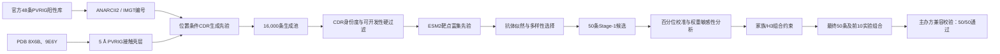

# PVRIG-PortfolioRank

用于复现 2026 SICBC PVRIG（CD112R）抗体赛道候选 VHH 序列生成、筛选、
阳性库相似性校验及实验组合排序的研究代码。

仓库提供：

- 完整的 CDR 生成与第一阶段筛选源代码；
- `PVRIG-PortfolioRank v2.0` 模型参数文件；
- 固定的第一阶段快照，可快速重放最终 50 条排序；
- 50 条候选序列、评分、自检和主办方兼容校验结果；
- 输入数据下载、哈希校验、环境锁定和自动化测试。

> 重要：模型分数是计算优先级代理，不是实测 Kd、IC50、阻断率或成功概率。
> 8X6B/9E6Y 只提供 PVRIG–PVRL2 接触组成先验，不代表候选抗体复合物已被
> 结构验证。

## 方法概览



核心组件与权重见
[`models/pvrig_portfolio_rank_v2.json`](models/pvrig_portfolio_rank_v2.json)，
详细原理、适用范围和限制见 [`MODEL_CARD.md`](MODEL_CARD.md)。

## 结果

- 最终候选数：50；
- 主办方内置 48 条阳性库兼容校验：50/50 通过；
- 最高对应 IMGT CDR 身份度：71.43%，低于本仓库 75%复核阈值；
- 前 10 实验组合：F1×2、F3×4、F4×2、F5×2；
- 前 10 中 H3 长度大于 18 aa：1 条。

结果文件：

- [`results/final_candidates.json`](results/final_candidates.json)：完整机器可读结果；
- [`results/final_candidates.csv`](results/final_candidates.csv)：便于审阅的扁平表；
- [`results/final_audit.json`](results/final_audit.json)：组合与一致性审计；
- [`results/validator_report.json`](results/validator_report.json)：阳性库校验报告；
- [`results/manifest.sha256`](results/manifest.sha256)：结果文件哈希。

## 环境

推荐配置：

- Python 3.11 或 3.12；
- 16 GB 内存；8 GB 可运行，但完整生成可能较慢；
- Apple Silicon MPS、CUDA 或 CPU；
- Git；
- 首次完整运行需要访问 GitHub、RCSB PDB 和 Hugging Face。

锁定的核心版本：

| 依赖 | 版本 |
|---|---:|
| ANARCII | 2.0.8 |
| Biopython | 1.87 |
| NumPy | 2.5.1 |
| PyTorch | 2.13.0 |
| Transformers | 4.57.6 |
| ESM2 | `facebook/esm2_t6_8M_UR50D` |

## 安装

```bash
git clone https://github.com/qikaiyin169-svg/pvrig-portfolio-rank.git
cd pvrig-portfolio-rank

python3 -m venv .venv
source .venv/bin/activate
python -m pip install --upgrade pip
python -m pip install -e .
python scripts/fetch_inputs.py
```

`fetch_inputs.py` 会：

1. 下载并校验 8X6B、9E6Y；
2. 克隆主办方校验器；
3. 固定到 commit `97df17aa09bc576a861cf0d8242de97af379fd80`。

## 两种复现方式

### 1. 快速重放最终排序

使用仓库内固定的第一阶段 50 条快照，重新执行校准、组合排序和官方兼容校验：

```bash
python scripts/reproduce.py --mode replay
```

输出位于 `output/replay/`。该模式适合审稿、代码审计和结果一致性验证，不重新
运行 ESM2 生成筛选阶段。

### 2. 从输入开始完整生成

```bash
python scripts/reproduce.py --mode full
```

完整模式会重新运行：

1. 阳性库 IMGT 编号；
2. 位置条件 CDR 生成；
3. PVRIG 接触组成筛选；
4. ESM2 嵌入式靶点富集；
5. 可开发性及多样性选择；
6. 最终组合排序与校验。

由于 GPU/MPS/CPU 数值内核差异，ESM2 得分在不同硬件上可能出现极小浮点差异。
仓库因此同时提供固定 Stage-1 快照和最终结果哈希，区分“算法完全重跑”和
“最终排序精确重放”。

## 单独使用命令

```bash
pvrig-design \
  --positive-csv vendor/ab-data-validator/src/ab_data_validator/data/positive.csv \
  --pdb-8x6b inputs/8X6B.pdb \
  --pdb-9e6y inputs/9E6Y.pdb \
  --model facebook/esm2_t6_8M_UR50D \
  --seed 20260726 \
  --pool-size 16000 \
  --output-json output/stage1_candidates.json \
  --output-csv output/stage1_candidates.csv

pvrig-finalize \
  --input-json output/stage1_candidates.json \
  --positive-csv vendor/ab-data-validator/src/ab_data_validator/data/positive.csv \
  --model-config models/pvrig_portfolio_rank_v2.json \
  --output-json output/final_candidates.json \
  --audit-json output/final_audit.json

PYTHONPATH="vendor/ab-data-validator/src:${PYTHONPATH}" pvrig-validate \
  --candidates-json output/final_candidates.json \
  --positive-csv vendor/ab-data-validator/src/ab_data_validator/data/positive.csv \
  --threshold 0.75 \
  --output-json output/validator_report.json \
  --output-csv output/validator_failures.csv
```

## 测试

```bash
python -m unittest discover -s tests -v
python scripts/export_results.py --check
```

测试覆盖模型配置权重、结果行数、序列唯一性、Rank 连续性、前 10 组合约束、
阳性库身份阈值和结果哈希。

## 仓库边界

- 不包含参赛 DOCX/XLSX、论文或专利全文；
- 不重新分发主办方阳性库和 PDB 文件；
- 不上传第三方 ESM2 权重，完整运行时按模型 ID 下载；
- 公开候选序列仅供研究与比赛复现，不构成有效性、安全性或知识产权结论。

第三方数据说明见 [`DATA.md`](DATA.md)。

## 许可证

源代码采用 MIT License。第三方模型、结构、阳性库和专利披露不因本仓库而
被重新许可，详见 [`DATA.md`](DATA.md)。
# PVRIG-PortfolioRank

用于复现 2026 SICBC PVRIG（CD112R）抗体赛道候选 VHH 序列生成、筛选、
阳性库相似性校验及实验组合排序的研究代码。

仓库提供：

- 完整的 CDR 生成与第一阶段筛选源代码；
- `PVRIG-PortfolioRank v2.0` 模型参数文件；
- 固定的第一阶段快照，可快速重放最终 50 条排序；
- 50 条候选序列、评分、自检和主办方兼容校验结果；
- 输入数据下载、哈希校验、环境锁定和自动化测试。

> 重要：模型分数是计算优先级代理，不是实测 Kd、IC50、阻断率或成功概率。
> 8X6B/9E6Y 只提供 PVRIG–PVRL2 接触组成先验，不代表候选抗体复合物已被
> 结构验证。

## 方法概览


核心组件与权重见
[`models/pvrig_portfolio_rank_v2.json`](models/pvrig_portfolio_rank_v2.json)，
详细原理、适用范围和限制见 [`MODEL_CARD.md`](MODEL_CARD.md)。

## 结果

- 最终候选数：50；
- 主办方内置 48 条阳性库兼容校验：50/50 通过；
- 最高对应 IMGT CDR 身份度：71.43%，低于本仓库 75%复核阈值；
- 前 10 实验组合：F1×2、F3×4、F4×2、F5×2；
- 前 10 中 H3 长度大于 18 aa：1 条。

结果文件：

- [`results/final_candidates.json`](results/final_candidates.json)：完整机器可读结果；
- [`results/final_candidates.csv`](results/final_candidates.csv)：便于审阅的扁平表；
- [`results/final_audit.json`](results/final_audit.json)：组合与一致性审计；
- [`results/validator_report.json`](results/validator_report.json)：阳性库校验报告；
- [`results/manifest.sha256`](results/manifest.sha256)：结果文件哈希。

## 环境

推荐配置：

- Python 3.11 或 3.12；
- 16 GB 内存；8 GB 可运行，但完整生成可能较慢；
- Apple Silicon MPS、CUDA 或 CPU；
- Git；
- 首次完整运行需要访问 GitHub、RCSB PDB 和 Hugging Face。

锁定的核心版本：

| 依赖 | 版本 |
|---|---:|
| ANARCII | 2.0.8 |
| Biopython | 1.87 |
| NumPy | 2.5.1 |
| PyTorch | 2.13.0 |
| Transformers | 4.57.6 |
| ESM2 | `facebook/esm2_t6_8M_UR50D` |

## 安装

```bash
git clone https://github.com/OWNER/pvrig-portfolio-rank.git
cd pvrig-portfolio-rank

python3 -m venv .venv
source .venv/bin/activate
python -m pip install --upgrade pip
python -m pip install -e .
python scripts/fetch_inputs.py
```

`fetch_inputs.py` 会：

1. 下载并校验 8X6B、9E6Y；
2. 克隆主办方校验器；
3. 固定到 commit `97df17aa09bc576a861cf0d8242de97af379fd80`。

## 两种复现方式

### 1. 快速重放最终排序

使用仓库内固定的第一阶段 50 条快照，重新执行校准、组合排序和官方兼容校验：

```bash
python scripts/reproduce.py --mode replay
```

输出位于 `output/replay/`。该模式适合审稿、代码审计和结果一致性验证，不重新
运行 ESM2 生成筛选阶段。

### 2. 从输入开始完整生成

```bash
python scripts/reproduce.py --mode full
```

完整模式会重新运行：

1. 阳性库 IMGT 编号；
2. 位置条件 CDR 生成；
3. PVRIG 接触组成筛选；
4. ESM2 嵌入式靶点富集；
5. 可开发性及多样性选择；
6. 最终组合排序与校验。

由于 GPU/MPS/CPU 数值内核差异，ESM2 得分在不同硬件上可能出现极小浮点差异。
仓库因此同时提供固定 Stage-1 快照和最终结果哈希，区分“算法完全重跑”和
“最终排序精确重放”。

## 单独使用命令

```bash
pvrig-design \
  --positive-csv vendor/ab-data-validator/src/ab_data_validator/data/positive.csv \
  --pdb-8x6b inputs/8X6B.pdb \
  --pdb-9e6y inputs/9E6Y.pdb \
  --model facebook/esm2_t6_8M_UR50D \
  --seed 20260726 \
  --pool-size 16000 \
  --output-json output/stage1_candidates.json \
  --output-csv output/stage1_candidates.csv

pvrig-finalize \
  --input-json output/stage1_candidates.json \
  --positive-csv vendor/ab-data-validator/src/ab_data_validator/data/positive.csv \
  --model-config models/pvrig_portfolio_rank_v2.json \
  --output-json output/final_candidates.json \
  --audit-json output/final_audit.json

PYTHONPATH="vendor/ab-data-validator/src:${PYTHONPATH}" pvrig-validate \
  --candidates-json output/final_candidates.json \
  --positive-csv vendor/ab-data-validator/src/ab_data_validator/data/positive.csv \
  --threshold 0.75 \
  --output-json output/validator_report.json \
  --output-csv output/validator_failures.csv
```

## 测试

```bash
python -m unittest discover -s tests -v
python scripts/export_results.py --check
```

测试覆盖模型配置权重、结果行数、序列唯一性、Rank 连续性、前 10 组合约束、
阳性库身份阈值和结果哈希。

## 仓库边界

- 不包含参赛 DOCX/XLSX、论文或专利全文；
- 不重新分发主办方阳性库和 PDB 文件；
- 不上传第三方 ESM2 权重，完整运行时按模型 ID 下载；
- 公开候选序列仅供研究与比赛复现，不构成有效性、安全性或知识产权结论。

第三方数据说明见 [`DATA.md`](DATA.md)。

## 许可证

源代码采用 MIT License。第三方模型、结构、阳性库和专利披露不因本仓库而
被重新许可，详见 [`DATA.md`](DATA.md)。
